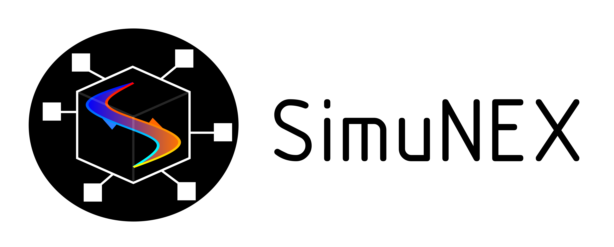
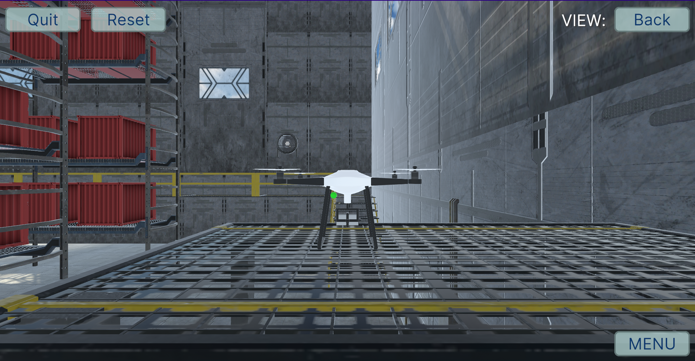
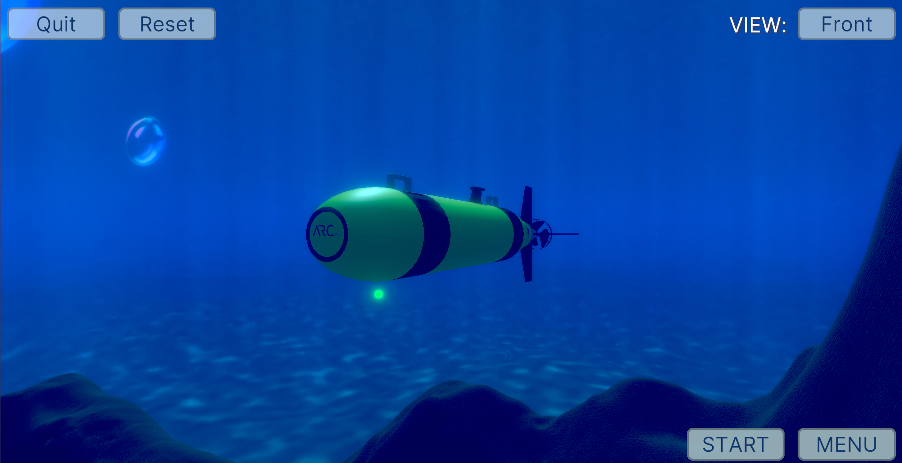
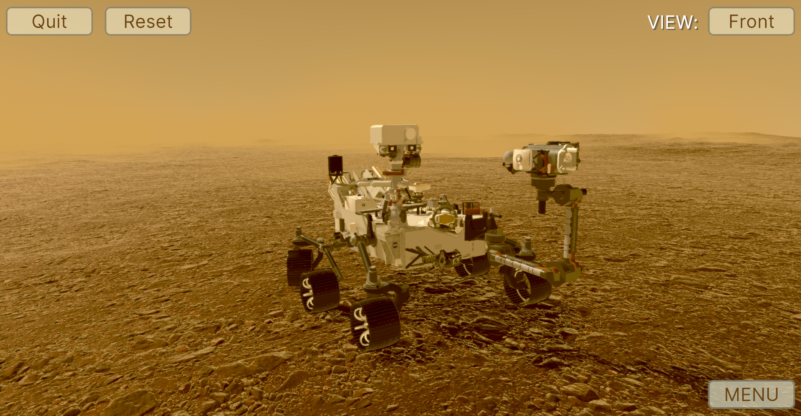
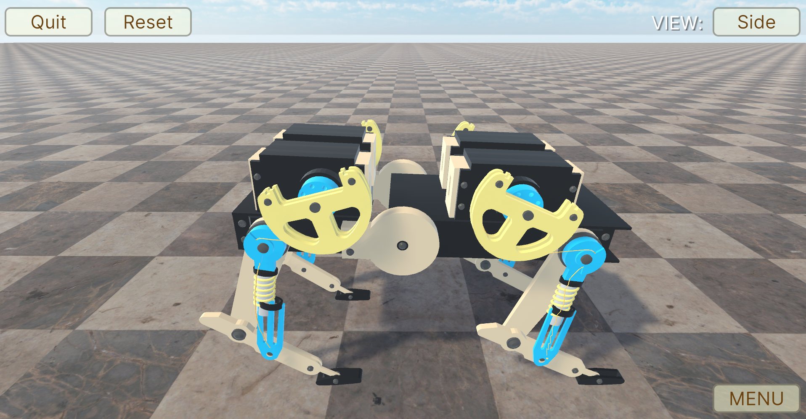
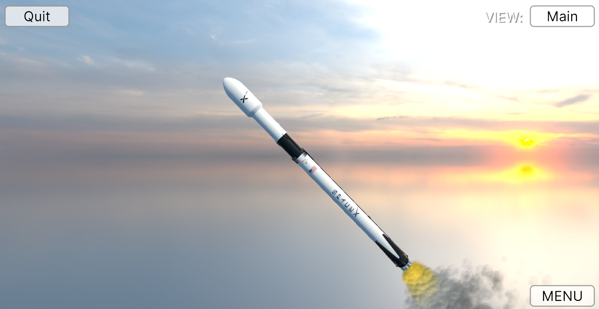

  
  
  

-----

<b>A modular high-fidelity dynamic simulation framework </b>
<i>that runs on top of Unity.</i>

-----

# SimuNEX
SimuNEX is a high-fidelity dynamic simulation framework designed as a modular platform to simulate dynamic systems across various domains. It serves as a powerful tool for researchers, engineering students, and members of the Intelligent Systems Lab, offering a versatile environment for simulating complex systems and phenomena.

## Examples
<table>
  <tr>
    <td align="center">
      
       
      <i>Quadcopter</i>
    </td>
    <td align="center">
      
       
      <i>AUV</i>
    </td>
    <td align="center">
      
       
      <i>Mars Rover</i>
    </td>
  </tr>
  <tr>
    <td align="center">
      
       
      <i>Quadruped Robot</i>
    </td>
    <td align="center">
      
       
      <i>Multi-stage Rocket</i>
    </td>
    <td align="center"></td> <!-- Empty space -->
  </tr>
</table>

## License
[![CC BY-NC-SA 4.0][cc-by-nc-sa-image]][cc-by-nc-sa]

[cc-by-nc-sa]: http://creativecommons.org/licenses/by-nc-sa/4.0/
[cc-by-nc-sa-image]: https://licensebuttons.net/l/by-nc-sa/4.0/88x31.png

SimuNEX © 2023 by [Lee Bissessar](https://github.com/leebissessar5), [Intelligent Systems Lab (ISL)](https://intelsyslab.com/) is licensed under the
[Creative Commons Attribution-NonCommercial-ShareAlike 4.0 International License.][cc-by-nc-sa] Under the license, you must give credit to ISL, provide a link to the license, and indicate if changes were made. You may do so in any reasonable manner, but not in any way that suggests that ISL endorses you or your use.